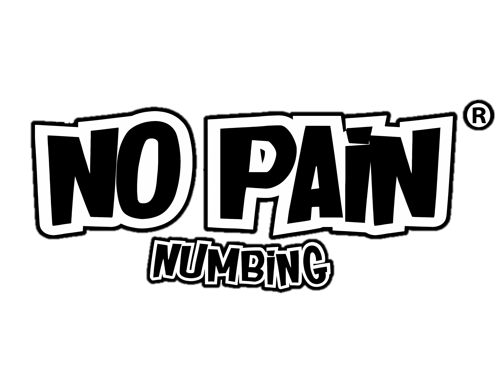

# 🖤 No Pain Brand – Premium Tattoo & PMU Products



## 🇪🇸 Español

**No Pain Brand** es una línea premium de productos anestésicos y de cuidado para tatuajes y micropigmentación (PMU).  
Incluye crema anestésica, tónicos, jabones y soluciones diseñadas con tecnología de última generación para garantizar una experiencia cómoda, segura y profesional, sin comprometer la calidad artística.

🌐 **Demo en vivo:** [Ver en Vercel](https://no-pain-web-project-26s6.vercel.app/)

### ✨ Características
- Crema anestésica premium para tatuajes y PMU.  
- Productos diseñados para artistas profesionales.  
- Distribuidores oficiales en América Latina, EE.UU. y Europa.  
- Sitio bilingüe: Español / Inglés.  
- Galería multimedia con soporte de video (Cloudinary).  
- Diseño minimalista y elegante (Next.js + TailwindCSS).  

### 🚀 Instalación local
```bash
# Clonar el repositorio
git clone https://github.com/rodriveracr/NoPainWebProject.git

# Entrar al proyecto
cd NoPainWebProject

# Instalar dependencias
npm install

# Correr en local
npm run dev
El sitio estará disponible en http://localhost:3000.

📦 Deploy en Vercel
Cada push a main se despliega automáticamente en producción:
👉 https://no-pain-web-project-26s6.vercel.app/

🇬🇧 English
No Pain Brand is a premium line of anesthetic and aftercare products for tattoos and permanent makeup (PMU).
Includes numbing cream, tonics, soaps, and solutions developed with state-of-the-art technology to ensure a comfortable, safe, and professional experience without compromising artistic quality.

🌐 Live Demo: View on Vercel

✨ Features
Premium numbing cream for tattoos & PMU.

Products designed for professional artists.

Official distributors in Latin America, USA, and Europe.

Bilingual site: Spanish / English.

Multimedia gallery with Cloudinary video support.

Minimalist & elegant design (Next.js + TailwindCSS).

🚀 Local Setup
bash
Copy code
# Clone repository
git clone https://github.com/rodriveracr/NoPainWebProject.git

# Enter project
cd NoPainWebProject

# Install dependencies
npm install

# Run locally
npm run dev
The site will be available at http://localhost:3000.

📦 Deploy on Vercel
Every push to main is automatically deployed to production:
👉 https://no-pain-web-project-26s6.vercel.app/

📩 Contacto / Contact
✉️ Email: customercare@nopainnumbing.net
📷 Instagram: @nopainnumbing

yaml
Copy code

---

👉 Este archivo lo guardas como `README.md` en la raíz de tu proyecto y luego:  

```bash
git add README.md
git commit -m "Add bilingual README"
git push origin main
